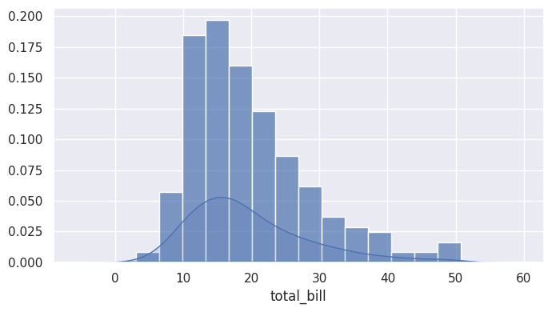
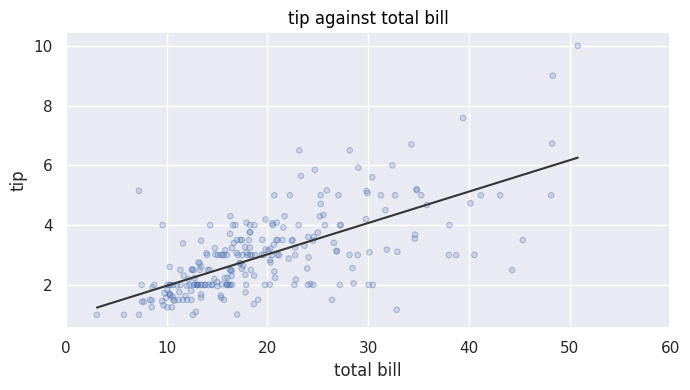
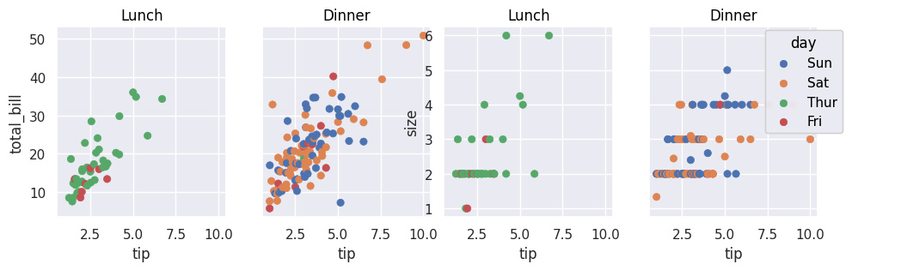
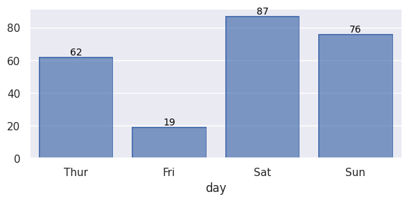

# soplot

Plot helpers for [seaborn.objects](https://seaborn.pydata.org/tutorial/objects_interface.html).

A seaborn plot is normally a call: marks, transforms and modifiers all go in as
arguments, and once the call is written the arrangement only exists inside it.
soplot declares those pieces as objects instead — a `SoLayer` per mark, an `MDF`
per modifier — so the arrangement is a value you can keep, pass around and apply
again. The work here is not a claim about prettier charts. It is about making a
figure reproducible: the same declaration, applied twice, draws the same thing.



## Install

Python 3.11 or newer.

```bash
python -m pip install -e .[dev]
```

With uv, note that `uv run pytest` does not install the extras:

```bash
uv run --extra dev pytest
```

## The idea

Every builder takes its configuration as objects and hands back an `so.Plot`
that has not been drawn yet:

```python
import seaborn as sns
import seaborn.objects as so

from soplot import MDF, SO, SoLayer

tips = sns.load_dataset("tips")

plot = so.Plot(tips, x="total_bill", y="tip")
plot = SO.add_layers(
    plot,
    SoLayer(so.Dots(alpha=0.4)),
    SoLayer(so.Line(color=".2"), so.PolyFit(order=1)),
)
plot = SO.modify_plot(plot, MDF.Label(title="tip against total bill"))
plot.show()
```

`so.Plot` is immutable, so `add_layers` and `modify_plot` return a new plot and
leave the one you passed in alone. The layers and modifiers are ordinary values:
keep them in a list, reuse them across figures, build them in a loop.



## What is in the box

| builder | what it draws |
|---|---|
| `SO.histogram` | bars with a density curve over them |
| `SO.outlier_box` | the sample itself plus five reference marks |
| `SO.compare_plot` | one variable against several features, a subfigure each |
| `SO.multi_outlier_box` | a box per feature, optionally a histogram above it |
| `SO.add_layers`, `SO.modify_plot` | apply a declaration to any plot |
| `add_barlabel` | label every bar of a drawn figure |



The per-feature arguments are `Args`: one entry per feature, and the last entry
repeats once the entries run out, so a single entry configures every subplot.
If you pass fewer subfigures than features, the builders raise rather than draw
what fits and drop the rest.

### The whiskers are clipped

`outlier_box` and `multi_outlier_box` draw Tukey's fences — `Q1 - 1.5 * IQR` and
`Q3 + 1.5 * IQR` — **clipped to the observed minimum and maximum**. That is
matplotlib's whisker convention, not the bare fences: a bound drawn on a plot
sits on a value the sample actually reaches. If you need the unclipped fences,
compute them yourself; `soplot._stats.get_iqr_bounds` is where the clipping
happens.

### The package is quiet

soplot configures no logging sink. It records through loguru under its own name
and disables that name on import, so nothing reaches your output unless you ask:

```python
from loguru import logger

logger.enable("soplot")
```

## The example

`examples/compare-plot/` runs every builder on seaborn's `tips` set, one section
each. It pins the stack it was last checked against:

```bash
cd examples/compare-plot
python -m pip install -r requirements.txt
```

Then open `compare-plot.ipynb` in whatever you run notebooks with — the pinned
stack holds the plotting libraries, not a notebook server.

Install from that directory, not from the repository root: the last line of
`requirements.txt` is a relative path, and pip resolves it against the working
directory. The notebook downloads its data, so the first run needs a network
connection.

`sample-run/` holds the pictures from a real run of that notebook.
`python make_sample_run.py` regenerates them from the notebook's own cells.

## Development

```bash
pytest                # 47 tests, no network
ruff check .
python make_sample_run.py   # from examples/compare-plot
```

`pyproject.toml` puts `src` on the path for pytest, so the tests run against the
sources without installing anything. CI runs the same two commands on Python
3.11 through 3.14, plus the example on the floor.

There is also a conda file:

```bash
conda env create -f environment.yml
```

## Two things that will catch you

- `add_barlabel` needs `so.Bar()`. A figure drawn with `so.Bars()` gives
  matplotlib no bar containers to read, so nothing is labelled — and nothing is
  raised either.
- `add_barlabel` takes the matplotlib figure, not the seaborn plotter: draw with
  `.on(figure).plot(pyplot=True)` first, then pass `figure`.



## Scope

This repository is here to be read, run and forked. I do not review pull
requests regularly. Fork it and make it yours.

## License

Apache License 2.0. See `LICENSE.txt`.
